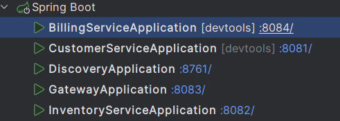
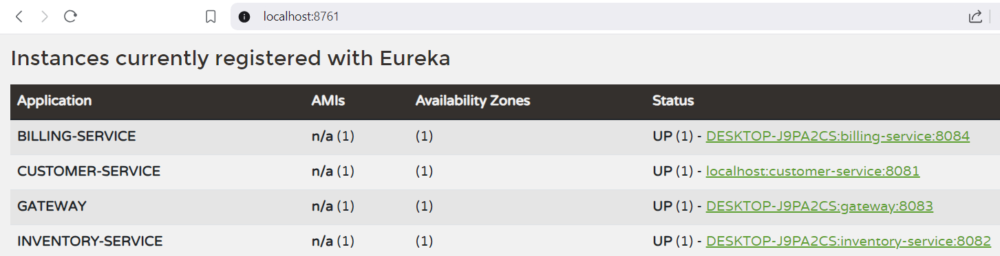
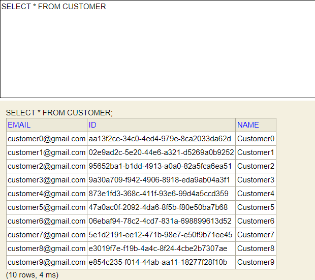
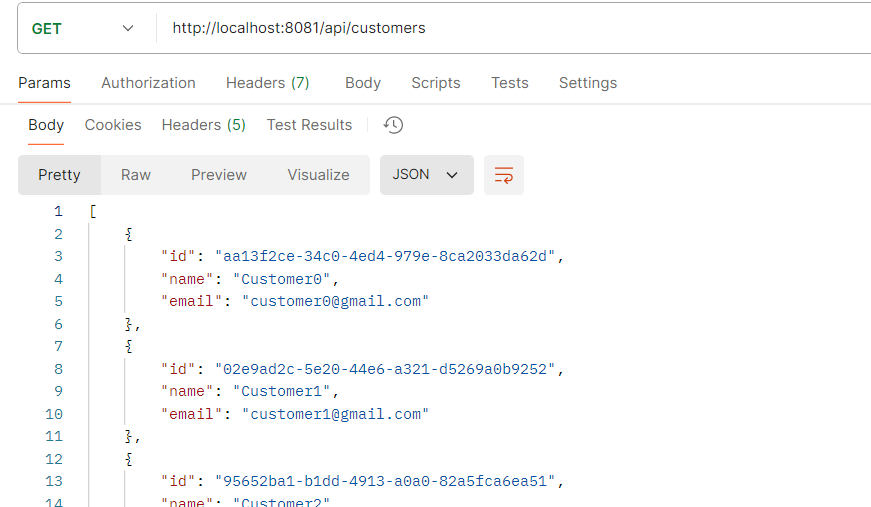
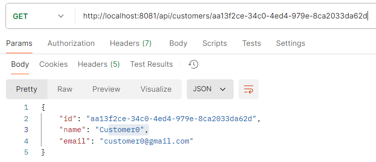
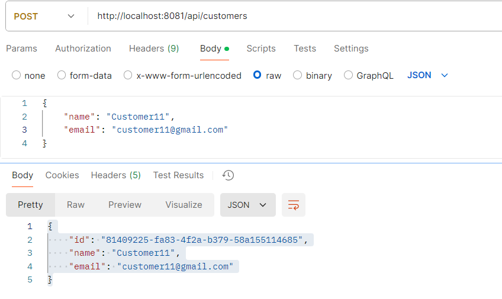
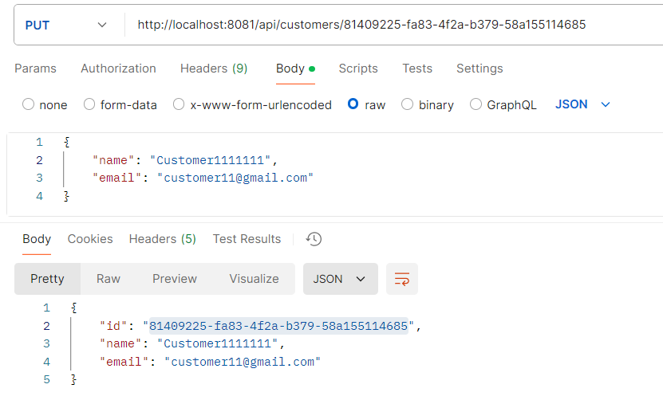
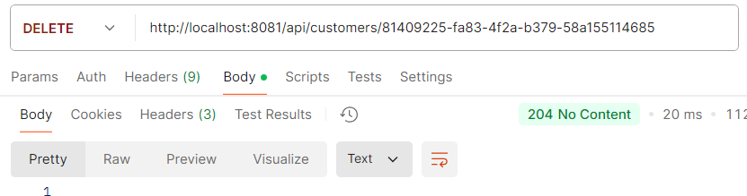
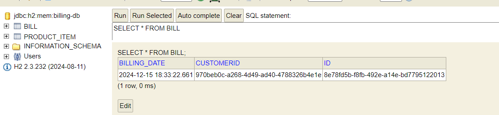
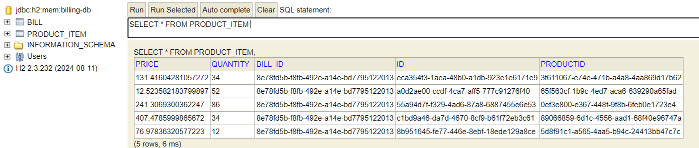

# Billing Microservices Application

## Overview
This project implements a microservices-based billing application using Spring Boot, Spring Cloud, and OpenFeign. The system integrates multiple services to manage customers, inventory, and billing operations. The microservices communicate with each other using REST APIs and service discovery through Eureka.

## Features
- **Customer Service**: Manages customer data.
- **Inventory Service**: Manages product inventory.
- **Billing Service**: Generates bills based on customers and products.
- **Service Discovery**: Centralized service registry using Eureka.
- **Gateway Service**: API Gateway for routing requests to the appropriate service.
- **Feign Clients**: Enables communication between microservices.
- **HATEOAS Support**: Returns paginated and navigable responses.

## Architecture
The project consists of the following microservices:
1. **Customer Service**
- Manages customers.
- Provides REST APIs to retrieve and manage customer information.
2. **Inventory Service**
- Manages product information and inventory.
- Provides paginated product details.
3. **Billing Service**
- Combines customer and product data to generate bills.
- Uses Feign Clients to communicate with Customer-Service and Inventory-Service.
4. **Service Discovery**
- Eureka Server for service registration and discovery.
5. **Gateway Service**
- API Gateway for routing requests to the appropriate service.

## Running the Application
1. **Clone the repository:**
```
git clone https://github.com/relmarrakchy/Microservices---Billing-app.git
cd Microservices---Billing-app
```
2. **Run the five microservices:**
- Eureka Server(Service Discovery)
- Customer Service
- Inventory Service
- Billing Service
- Gateway Service

3. **Access the Services:**
- Eureka Server: http://localhost:8761
- Customer Service: http://localhost:8081/customers
- Inventory Service: http://localhost:8082/products
- Billing Service: http://localhost:8084
- Gateway Service: http://localhost:8083

## Testing the Application
1. **Running the services:**



2. **Eureka server :**



3. **Customer service :**


**get all customers :**

**get customer by id :**

**create customer :**

**update customer :**

**delete customer :**


Same thing for inventory service.

4. **Billing service :**


